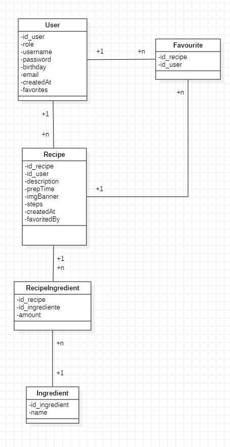

# Tofu App

---

### Descripcion

Red social en el que la gente sube lo que ha comido en el dia, comparte recetas  y tiene un espacio para organizarse su planning de comida

--- 

### Entidades

**Usuario:**

- <u>Atributos:</u> *ID, role, nombre, contraseña, cumpleaños, email*

- Acciones: Crear recetas y añadir recetas de otros usuarios a su lista

- Si es admin o cocinero, puede añadir ingredientes a la base de datos

**Receta:**

- <u>Atributos:</u>  *ID, categoria, tipo de plato, descripcion, lista de ingredientes, lista de pasos, imagen de portada, tiempo de preparacion*

**Categoria:**

- <u>Atributos: </u>*ID, nombre categoria*

- Vegetariano, vegano, hipocalorica, proteica...

**Tipo de plato:**

- <u>Atributos: </u> *ID, tipo de plato
- Desayuno, cena, almuerzo, snack, postre

**Pasos:**

- <u>Atributos:</u>  *ID, numero del paso, descripcion*

**Ingrediente:**

- <u>Atributos:</u>  *ID, nombre, cantidad*

---

## Ideas para agrandarlo

- Puede gestionar sus comidas de la semana en un calendario

- Puede descubrir nuevas recetas de otras personas

- Puede añadir planning de semanas de otras personas

- Puedes añadir comentarios y valorar las recetas

- Lista de la compra con ingredientes necesarios para la siguiente semana

- Incluir valor nutricional en los ingredientes (kcal por 100gr, carbohidratos, proteinas...) 

- Relacionar los ingredientes con el usuario, y que este tambien tenga lista de ingredientes

---

## Modelo de datos

---

## Diseño

---

## Notas
