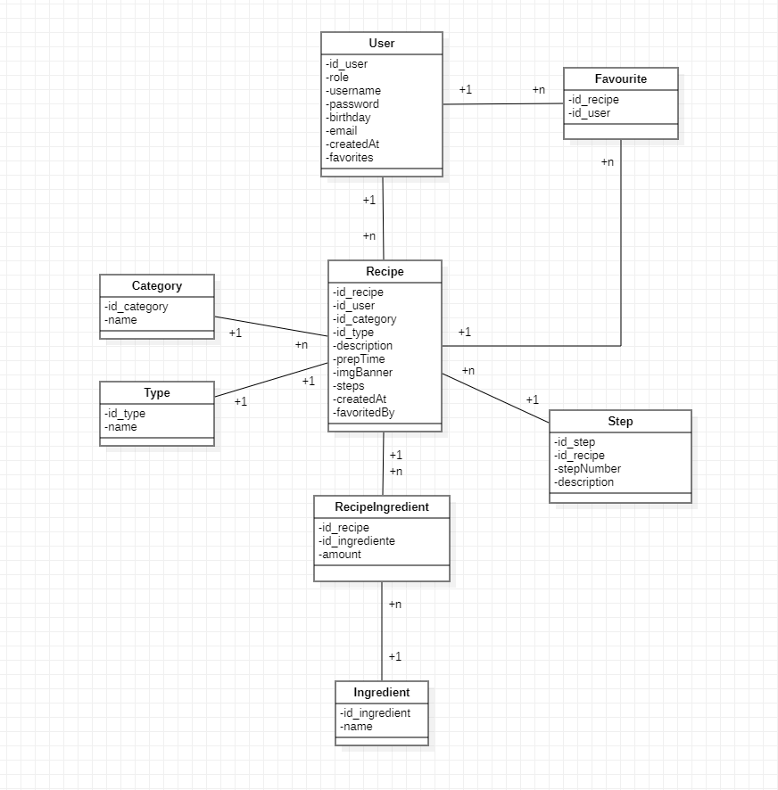

# Tofu App

---

### Descripcion

Red social similar a instagram en la que la gente puede subir recetas, crear sus propios plannings semanales, subir lo que comen en el dia, y compartir todo esto con otros usuarios.

--- 

### Entidades (DEPRECATED, toca actualizar)

**Usuario:**

- <u>Atributos:</u> *ID, role, nombre, contraseña, cumpleaños, email*

- Acciones: Crear recetas y añadir recetas de otros usuarios a su lista

- Si es admin o cocinero, puede añadir ingredientes a la base de datos

**Receta:**

- <u>Atributos:</u>  *ID, categoria, tipo de plato, descripcion, lista de ingredientes, lista de pasos, imagen de portada, tiempo de preparacion*

**Categoria:**

- <u>Atributos: </u>*ID, nombre categoria*

- Vegetariano, vegano, hipocalorica, proteica...

**Tipo de plato:**

- <u>Atributos: </u> *ID, tipo de plato
- Desayuno, cena, almuerzo, snack, postre

**Pasos:**

- <u>Atributos:</u>  *ID, numero del paso, descripcion*

**Ingrediente:**

- <u>Atributos:</u>  *ID, nombre, cantidad*

---

## Ideas para agrandarlo

- Puede gestionar sus comidas de la semana en un calendario

- Puede descubrir nuevas recetas de otras personas

- Puede añadir planning de semanas de otras personas

- Puedes añadir comentarios y valorar las recetas

- Lista de la compra con ingredientes necesarios para la siguiente semana

- Incluir valor nutricional en los ingredientes (kcal por 100gr, carbohidratos, proteinas...) 

- Relacionar los ingredientes con el usuario, y que este tambien tenga lista de ingredientes

- "Stories" para subir tu comida del dia, parecido a bereal

- Lista de seguidores de cada usuario

---

## Modelo de datos

---

## Diseño

- **Paginas:** Login, Register, Listado de recetas de seguidores, listado de busqueda, pagina de detalles de receta, detalles de ingrediente, perfil, Lista de me gusta, lista de seguidores, creacion de recetas, creacion de ingredientes, vista calendario del planning semanal, vista de lista de compra

- **Colores de acento:** Verde Lima, purpura, naranja

- **Themes:** Dark theme, Light theme

- **Tipografia:** Montserrat y OpenSans

- **Logo:** Un bloque de tofu con un fondo de estrella

---

## Notas

Preguntar a luismi por si se puede integrar firebase
